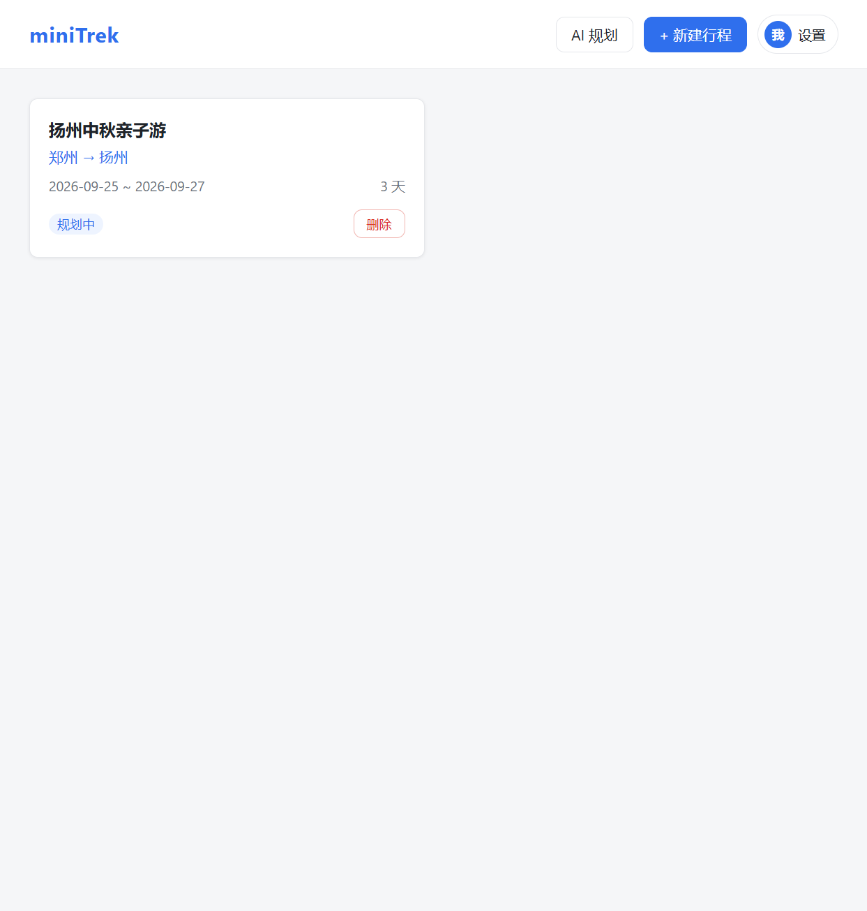
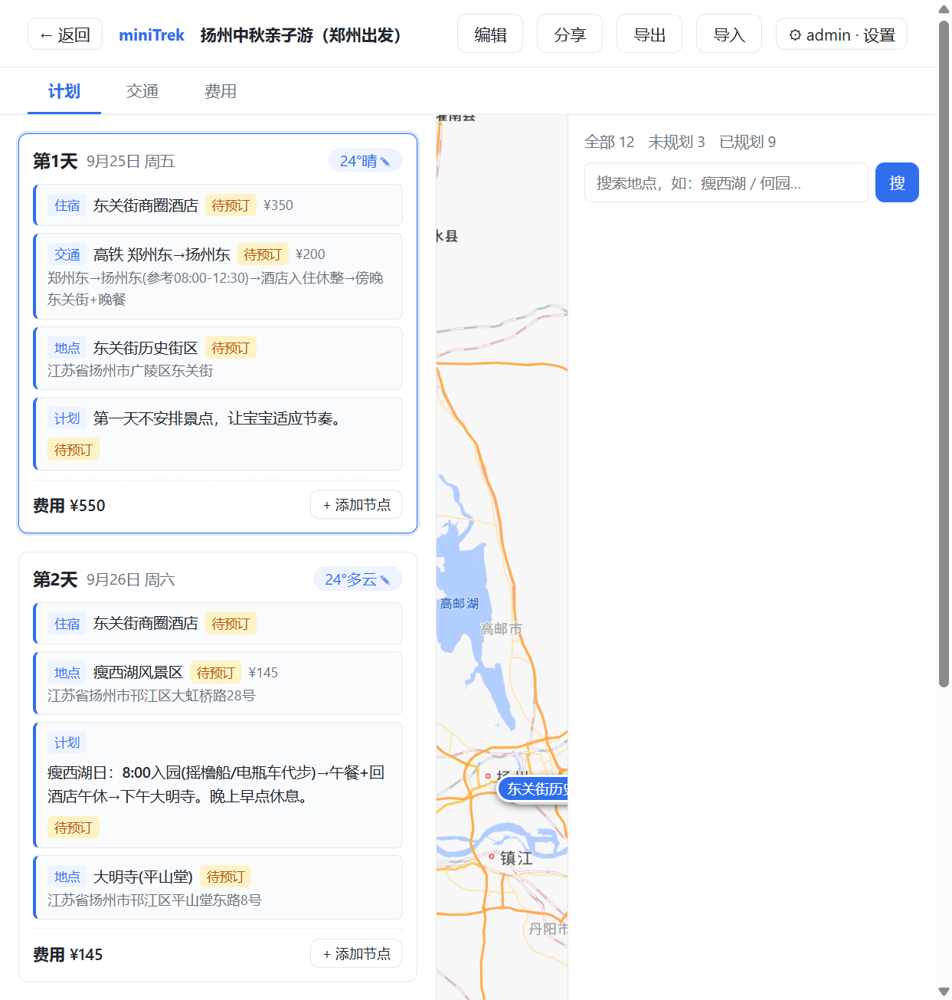

# miniTrek · 轻量家庭旅行规划平台

面向国内家庭场景的轻量旅行规划平台。**平台专注行程展示与手动编辑，AI 规划能力通过 MCP 接口接入用户自己的 AI 客户端**，交通只查不订，部署在飞牛 NAS 上自托管。





## 核心特性
- Web 桌面端：首页行程项目列表 + 行程详情三栏（时间线 / 高德地图 / 地点面板）
- 三种规划通道：AI（MCP）规划、手动规划、AI 生成后微调
- **天气自动查询**（Open-Meteo 免费源，进入行程自动按城市/日期拉取，可手动覆盖或刷新）
- **交通标签页**：实时查询 12306 车次/余票/票价，一键加入行程（用户自行预订）
- **费用标签页**：总费用、按类型汇总、按天明细自动统计
- **地点搜索 / 地址定位**（高德 Web 服务，可一键把 POI 加入行程并带坐标）
- 只读分享链接，家人免登录查看（含地图）
- 行程节点拖拽排序（跨天 + 天内随意调整）、手动增删改
- 行程信息编辑：修改行程标题、出发地、目的地、起止日期（日期变更智能保留仍在范围内的天与节点）
- **行程导入 / 导出（Markdown）**：一键导出行程为 .md，或按标准格式手动编写 / 粘贴 / 上传 md 导入为**新行程**
- MCP 接入配置生成器：一键生成 API Token 并导出可导入豆包 / Claude / Cursor 的 MCP 配置

## 已实现功能一览
| 模块 | 说明 |
|---|---|
| 行程管理 | 首页新建/删除行程，详情三栏布局；顶部「编辑」可改标题/出发/目的地/日期 |
| 每日卡片 | 第N天/日期/自动天气/节点（类型徽标）平铺/费用小计，节点拖拽排序（天内、跨天均支持） |
| 地图 | 高德 JS API，按选中天渲染点位、点击弹详情、视野自适应 |
| 天气 | 自动查询（Open-Meteo），手工可覆盖，超预报范围有提示 |
| 交通 | 12306 实时车次/余票/票价查询，加入行程生成交通节点 |
| 费用 | 按类型/按天汇总 + 总费用 |
| 地点搜索 | 右栏 POI 搜索（高德 Web 服务 Key），一键添加带坐标节点 |
| 地址定位 | 节点编辑弹窗「定位」按钮，地址→经纬度 |
| 分享 | 生成只读链接 `/share/:token`，家人免登录查看 |
| 设置 | 右上角「我」进入，配置高德 JS Key 与 Web 服务 Key，以及 MCP API Token |
| 登录与密码管理 | 访问需登录（初始密码=部署时 `MINITREK_ADMIN_PASSWORD`）；设置页可修改密码、恢复密码（命令行重置）、退出登录 |
| AI 规划配置 | 首页「AI 规划」弹窗：3 步生成 Token → 填地址 → 按客户端导出 MCP 配置 |
| 导入/导出 | 详情页「导出」下载行程 .md；「导入」弹窗支持粘贴/上传/填模板，解析预览后一键导入为新行程 |

## 登录与密码管理
- **登录**：Web 端所有页面（除只读分享 `/share/:token` 与登录页）需登录后访问，未登录自动跳转登录页。
- **初始密码**：部署时环境变量 `MINITREK_ADMIN_PASSWORD`（Docker/.env），默认 `changeme`。
- **修改密码**：右上角「我」→ 设置 → 账号与安全 → 修改登录密码（需原密码，新密码至少 6 位）。修改后写入本地数据库，无需改动 .env。
- **恢复密码（忘记密码时）**：在服务器/NAS 上执行：
  ```bash
  docker exec -it minitrek node --import tsx src/scripts/reset-password.ts
  ```
  不传参数自动生成随机新密码并打印；也可在后面跟一个 6 位以上新密码。重置后所有旧登录会话立即失效。
- **会话**：登录签发随机 Token（30 天有效，哈希存库），浏览器本地保存；「退出登录」即时失效。
- **与 MCP 的关系**：Web 登录与 MCP 互不影响——AI 客户端继续用 `MINITREK_MCP_TOKEN` / 页面生成的 `mtk_` Token 连接 `/mcp`，无需 Web 登录。

## MCP Server（AI 规划通道）
端点 `http://<地址>:8288/mcp`，认证 `Authorization: Bearer <Token>`。
Token 两种方式：
1. **页面生成**：首页「AI 规划」或设置页「MCP API Token」点击「生成新 Token」，得到 `mtk_` 开头的明文（仅显示一次，后端只存哈希）；
2. **环境变量**：部署时设 `MINITREK_MCP_TOKEN`。

首页「AI 规划」弹窗会按所选客户端（通用/Claude、Cursor、豆包）自动生成完整配置 JSON，含地址与 Token，可复制或下载 `.json`。填写可访问地址时平台**自动补全默认端口 8288**（如填 `192.168.1.100` 生成 `http://192.168.1.100:8288/mcp`；已自填端口或 HTTPS 反代则保留）。
已实现的工具：
| 工具 | 作用 |
|---|---|
| `create_trip` / `list_trips` / `get_trip` / `update_trip` | 行程 CRUD |
| `add_day` | 增加一天安排 |
| `add_activity` / `update_activity` / `delete_activity` / `move_activity` | 行程节点增删改与移动排序 |
| `add_checklist_item` | 添加出行清单项 |
| `get_trip_summary` | 行程汇总（天数/费用/节点数） |
| `query_train` | 查询 12306 车次/余票/票价（代理自 12306-mcp） |
| `search_station` | 通过城市/站名查询 12306 车站代码 |

在支持 MCP 的 AI 客户端（豆包/Claude/Cursor 等）中配置该 Server 地址与 Token，AI 即可直接创建和编辑行程，并实时查询火车票，Web 端实时可见。

## 文档
| 文档 | 说明 |
|---|---|
| [docs/PRD.md](docs/PRD.md) | 需求文档（功能需求、页面设计、MVP 范围） |
| [docs/TECHNICAL.md](docs/TECHNICAL.md) | 技术方案（技术栈、数据模型、MCP 工具、部署） |

## 技术栈
Vue 3 + Node.js (TypeScript) + Fastify + better-sqlite3/Drizzle ORM + MCP SDK + 高德地图 + Docker

## 目录
```
minitrek/
├─ server/          Node 后端（REST + MCP + 数据层）
├─ web/             Vue 3 前端
├─ docker/          构建与部署
├─ data/            SQLite 数据（Docker 挂载卷 /app/data；本地开发在 server/data）
├─ docker-compose.yml
└─ docs/            需求与设计文档
```

## 高德地图配置（两个 Key）
| Key | 类型 | 用途 | 配置方式 |
|---|---|---|---|
| 高德地图 Key | 高德「Web端(JS API)」 | 地图展示、点位渲染 | 设置页或环境变量 `AMAP_KEY` |
| 高德 Web 服务 Key | 高德「Web服务」 | 地点搜索、地址定位 | 设置页或环境变量 `AMAP_WEB_KEY` |

右上角「我」→ 设置页填写（存储于数据库，留空=清除）。未配置地图 Key 时地图区显示引导提示；未配置 Web 服务 Key 时地点搜索/定位给出提示。
天气查询不依赖高德（使用免费 Open-Meteo 数据源，无需配置）。

## 本地开发（Windows）
```powershell
# 1. 启动后端（8288 端口，首次启动自动建表）
cd server
npm install
npm run dev

# 2. 启动前端（5173 端口，/api 自动代理到 8288）
cd web
npm install
npm run dev
# 浏览器访问 http://localhost:5173
```

## 服务状态检查与重启（本机开发）
本机由三个进程组成，**机器重启后均会掉线，需手动拉起**（见 `start-all.ps1`）：

| 服务 | 端口 | 说明 |
|---|---|---|
| 前端 Vite | **5173** | Web 页面 |
| 后端（REST + MCP） | **8288** | `/api` 与 `/mcp` |
| 12306 车次代理 | **9999** | 内部查询服务 |

### 检查状态
```powershell
# ① 三个端口是否都在监听
netstat -ano | findstr "LISTENING" | findstr ":5173 :8288 :9999"

# ② 前端页面可访问
# 浏览器打开 http://localhost:5173

# ③ 后端健康
Invoke-WebRequest http://localhost:8288/api/health

# ④ MCP 端点（返回 200 说明 AI 客户端可连）
Invoke-WebRequest http://localhost:8288/mcp -Method POST -ContentType "application/json" `
  -Body '{"jsonrpc":"2.0","id":1,"method":"initialize","params":{"protocolVersion":"2024-11-05","capabilities":{},"clientInfo":{"name":"check","version":"1"}}}' `
  -Headers @{Authorization="Bearer <你的Token>"}
```
> 三个端口都有 `LISTENING` 且 ③通过即为正常。重启机器后三个服务都要重新拉起。

### 一键启动（start-all.ps1）
项目根目录已有 `start-all.ps1`，PowerShell 中执行即可拉起三个服务：
```powershell
powershell -ExecutionPolicy Bypass -File D:\AI\DouBao\01 miniTrek\start-all.ps1
```
> 若 12306 代理偶发启动慢，等待 10~20 秒后再 `netstat` 确认 9999。

### 重启单个服务
```powershell
# 以 8288 为例：先结束占用进程，再按「本地开发」对应命令重新启动
$p = (Get-NetTCPConnection -LocalPort 8288 -State Listen).OwningProcess
Stop-Process -Id $p -Force
```
> 部署到飞牛 NAS（Docker）后无需上述操作：`docker compose up -d` 自动常驻、开机自启、崩溃自愈，只需 `docker compose ps` 确认三个服务为 Up。

## 部署到飞牛 NAS（Docker）
> ✅ **已在飞牛 fnOS（Docker 28 + Compose v2）实测通过**：`node:20-slim` 基础镜像 + npmmirror 依赖源构建成功，Web / REST / MCP / 12306 代理四端全通。

```bash
# 在 NAS 上：把整个项目目录拷入（或用 git），配置 .env
cp .env.example .env   # 修改 MINITREK_ADMIN_PASSWORD（Web 登录初始密码，默认 changeme）
                       #   与 MINITREK_MCP_TOKEN（AI 客户端连 MCP 用）
                       # 可选：AMAP_KEY / AMAP_WEB_KEY（也可进设置页填）
                       # 建议设置：MINITREK_12306_MCP_URL=http://12306-mcp:8080/mcp（compose 已默认）

# 构建并启动（含 12306-mcp 内部代理服务）
docker compose up -d --build

# 访问
#  Web:  http://<NAS-IP>:8288   （首次需用 MINITREK_ADMIN_PASSWORD 登录）
#  MCP:  http://<你的DDNS域名或IP>:8288/mcp  （Authorization: Bearer <MINITREK_MCP_TOKEN>，无需 Web 登录）
```
> 构建提示：若 `docker pull node:20-slim` 在飞牛镜像加速器偶发 401，重试或直接 `docker pull node:20-slim` 拉取后重建；Dockerfile 已内置 `npm config set registry https://registry.npmmirror.com` 加速依赖安装。
> MCP 远程访问经 DDNS 暴露，建议在 NAS 反向代理上套 HTTPS。
> 数据库落在挂载卷 `./data`（服务内 `/app/data`），备份=复制该目录下的 `.db` 文件。

## 常用 REST API
> 除 `/api/health`、`/api/auth/login`、`/api/share/:token` 外，`/api/*` 均需登录（`Authorization: Bearer <登录Token>`，登录接口返回）。
| 方法 | 路径 | 说明 |
|---|---|---|
| POST | /api/auth/login | 登录（密码），返回会话 Token |
| POST | /api/auth/logout | 登出（使当前会话失效） |
| GET | /api/auth/me | 当前登录态（authed / passwordConfigured） |
| POST | /api/auth/change-password | 修改登录密码（需原密码，新密码≥6 位） |
| GET/POST | /api/trips | 行程列表 / 新建 |
| POST | /api/trips/import | 批量导入行程（Markdown 导入走此接口，一次建行程+天数+节点） |
| GET/PATCH/DELETE | /api/trips/:id | 详情 / 更新 / 删除 |
| POST | /api/days/:dayId/activities | 添加节点 |
| PATCH/DELETE | /api/activities/:id | 编辑 / 删除节点 |
| POST | /api/activities/:id/move | 拖拽排序/移动 |
| PATCH | /api/days/:id | 更新天气/备注 |
| GET | /api/weather?city=&date= | 天气查询（Open-Meteo） |
| GET | /api/train/query?date=&from=&to= | 12306 车次/余票/票价 |
| GET | /api/train/stations?city= | 车站代码 |
| GET | /api/poi/search?keywords=&city= | 地点搜索（高德 Web 服务） |
| GET | /api/geocode?address= | 地址→经纬度 |
| GET/PUT | /api/settings | 读取/保存设置 |
| GET/POST | /api/mcp/token | 查询 / 生成 MCP API Token（仅存哈希，明文只返回一次） |
| POST | /api/trips/:id/share | 生成分享链接 |
| GET | /api/share/:token | 只读分享数据 |
